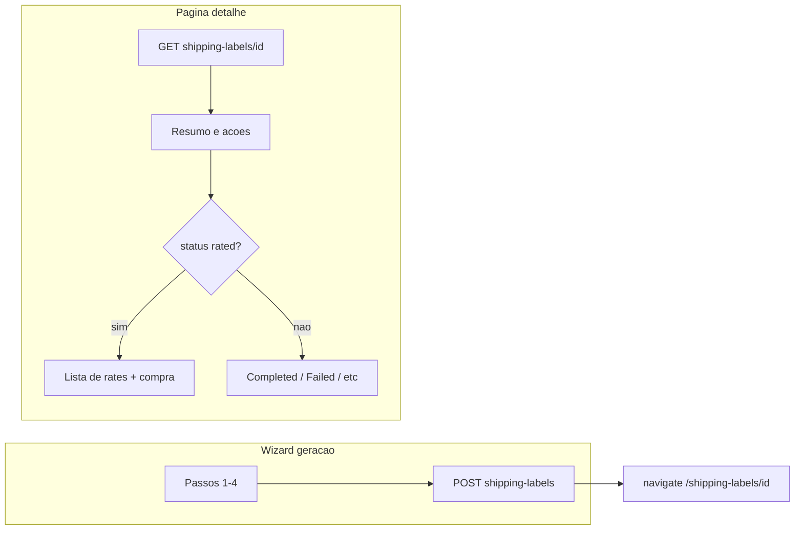

# Plano: detalhe de shipping labels, rota estável para rates e listagem rica

## Contexto atual

- O wizard em [`resources/js/pages/CreateLabelPage.jsx`](resources/js/pages/CreateLabelPage.jsx) usa `useState(0)` para o passo; o passo 5 (“Rates”) só existe em memória. Um F5 reinicia em `step === 0`, daí o problema.
- A rota é [`/shipping-labels/generate/:integrationKey`](resources/js/App.jsx) (ex.: `easypost`), não há segmento de URL por label após a cotação.
- O backend já suporta o fluxo completo:
  - `POST /api/shipping-labels` → cria label e retorna o mesmo payload “rico” que o `show` ([`ShippingLabelController::serializeLabel`](app/Http/Controllers/Api/ShippingLabelController.php)).
  - `GET /api/shipping-labels/{id}` → detalhe com `status`, `rates`, `easypost_messages`, etc.
  - `POST /api/shipping-labels/{id}/purchase` com `rate_id` → compra (só se `status.slug === rated`).
- A listagem em [`resources/js/pages/ShippingLabelsPage.jsx`](resources/js/pages/ShippingLabelsPage.jsx) só exibe `#id`, badge de status, `carrier` e `tracking_code`. O modelo [`ShippingLabel`](app/Models/ShippingLabel.php) expõe `from_address`, `to_address`, `parcel`, `integration_key`, `created_at` na serialização JSON ( `quote_snapshot` continua oculto), então dá para enriquecer a UI sem mudança obrigatória de API.

## 1. Nova rota e página de detalhe

- Adicionar em [`resources/js/App.jsx`](resources/js/App.jsx) uma rota **estática antes** do catch-all genérico, por exemplo:
  - `path="/shipping-labels/:labelId"` → novo componente `ShippingLabelDetailPage` (nome do param alinhado ao restante do app).
- **Ordem das rotas:** manter `/shipping-labels/generate` e `/shipping-labels/generate/:integrationKey` **acima** de `/shipping-labels/:labelId` para não confundir `generate` com um `id`.
- Implementar `ShippingLabelDetailPage` (novo ficheiro em `resources/js/pages/`):
  - `useParams` + `useEffect` → `GET /shipping-labels/:id` (cliente em [`resources/js/api/http.js`](resources/js/api/http.js)).
  - Estados: loading, erro 404, dados do label.
  - Conteúdo mínimo: integração, status (nome + slug), datas, resumo from/to/parcel (reutilizar lógica de formatação já existente em `CreateLabelPage` — extrair para um módulo partilhado pequeno, ex. `resources/js/utils/shippingLabelFormat.js`, para não duplicar `formatAddrSummary` / referências EasyPost).
  - Se `status.slug === 'rated'`: secção com a **mesma tabela de rates + radio + botão “Purchase label”** que hoje está no passo 5 (pode ser um subcomponente `RatesPurchaseSection` partilhado entre `CreateLabelPage` e a página de detalhe, ou só copiar a marcação uma vez e refatorar depois — preferir extrair componente para um único lugar).
  - Após compra bem-sucedida: atualizar estado com resposta do `POST` ou refetch do `GET`; opcionalmente `navigate` para a mesma URL com dados atualizados (status `completed`).
  - Se `completed`: link “Open label” para `label_url`, tracking, carrier/service.
  - Se `failed`: `last_error`.
  - Link “Back to list” → `/shipping-labels`.

## 2. Ajustar o fluxo de geração (resolver F5 no último passo)

- Em [`CreateLabelPage.jsx`](resources/js/pages/CreateLabelPage.jsx):
  - Reduzir o wizard a **4 passos** no `STEPS` / `StepIndicator`: Ship from, Ship to, Package, Review (remover o passo “Rates” do indicador local).
  - Em `requestRates`, após `POST` bem-sucedido, em vez de `setStep(4)`, fazer **`navigate(`/shipping-labels/${data.id}`)** (ou com query opcional `?focus=rates` se quiser scroll — não obrigatório).
  - Remover o bloco JSX do `step === 4`, `goBack` especial do passo 4, e estado que só servia o passo 5 **no wizard** (`labelId`, `rates`, `easypostMessages`, `selectedRateId` podem sair deste ficheiro se toda a compra for só na página de detalhe).
  - Ajustar `goBack` para já não referir o passo 4.

Assim, quem der F5 no “último passo” está na **URL do label**, e o detalhe recarrega com `GET`.

## 3. Melhorar a listagem e navegação para o detalhe

- Em [`ShippingLabelsPage.jsx`](resources/js/pages/ShippingLabelsPage.jsx):
  - Tornar cada linha clicável: `Link` para `/shipping-labels/${row.id}` **ou** linha com `onClick` + `navigate` (preferir `Link` por acessibilidade e Cmd+clique).
  - Mostrar mais colunas/resumo: **data** (`created_at` formatada), **integração** (`integration_key`), **rota** curta (ex.: cidade/estado de origem → destino a partir de `from_address` / `to_address`), e manter status; para `completed`, continuar a mostrar carrier/tracking quando existirem.
  - Opcional: para `rated`, um hint “Awaiting rate” / CTA visual alinhado ao copy do seeder.

## 4. Backend (opcional, só se quiser lista mais leve ou contrato explícito)

- Hoje o index devolve modelos paginados com `from_address`/`to_address` completos. Se no futuro a lista crescer, considerar um `serializeLabelListItem()` no [`ShippingLabelController`](app/Http/Controllers/Api/ShippingLabelController.php) com apenas campos de resumo + `rates_count` (derivado do snapshot sem enviar `rates` completos). **Não é obrigatório** para a primeira entrega se a UI usar só campos já expostos.

## 5. Testes

- **PHP:** garantir que [`tests/Feature/ShippingLabelApiTest.php`](tests/Feature/ShippingLabelApiTest.php) continua a cobrir `show` e `purchase`; ajustar apenas se o contrato JSON mudar.
- **Frontend:** se existirem testes de rota, adicionar caso simples para a nova rota; caso contrário, validação manual do fluxo: gerar → redirect para detalhe → F5 mantém dados → compra.

## Ficheiros principais a tocar

| Área | Ficheiros |
|------|-----------|
| Rotas SPA | [`resources/js/App.jsx`](resources/js/App.jsx) |
| Wizard | [`resources/js/pages/CreateLabelPage.jsx`](resources/js/pages/CreateLabelPage.jsx) |
| Novo | `resources/js/pages/ShippingLabelDetailPage.jsx`, possivelmente `resources/js/components/RatesPurchaseSection.jsx` e `resources/js/utils/shippingLabelFormat.js` |
| Lista | [`resources/js/pages/ShippingLabelsPage.jsx`](resources/js/pages/ShippingLabelsPage.jsx) |
| API (opcional) | [`app/Http/Controllers/Api/ShippingLabelController.php`](app/Http/Controllers/Api/ShippingLabelController.php) |

## Critérios de aceitação

1. Após “Get shipping rates”, o browser navega para `/shipping-labels/:id` e um F5 mantém a tela de detalhe com rates (se ainda `rated`).
2. Na listagem, cada label leva ao detalhe; a linha mostra mais contexto (data, rota, integração) além do mínimo atual.
3. No detalhe com status `rated`, o utilizador vê a listagem de rates e pode concluir a compra sem voltar ao wizard.
