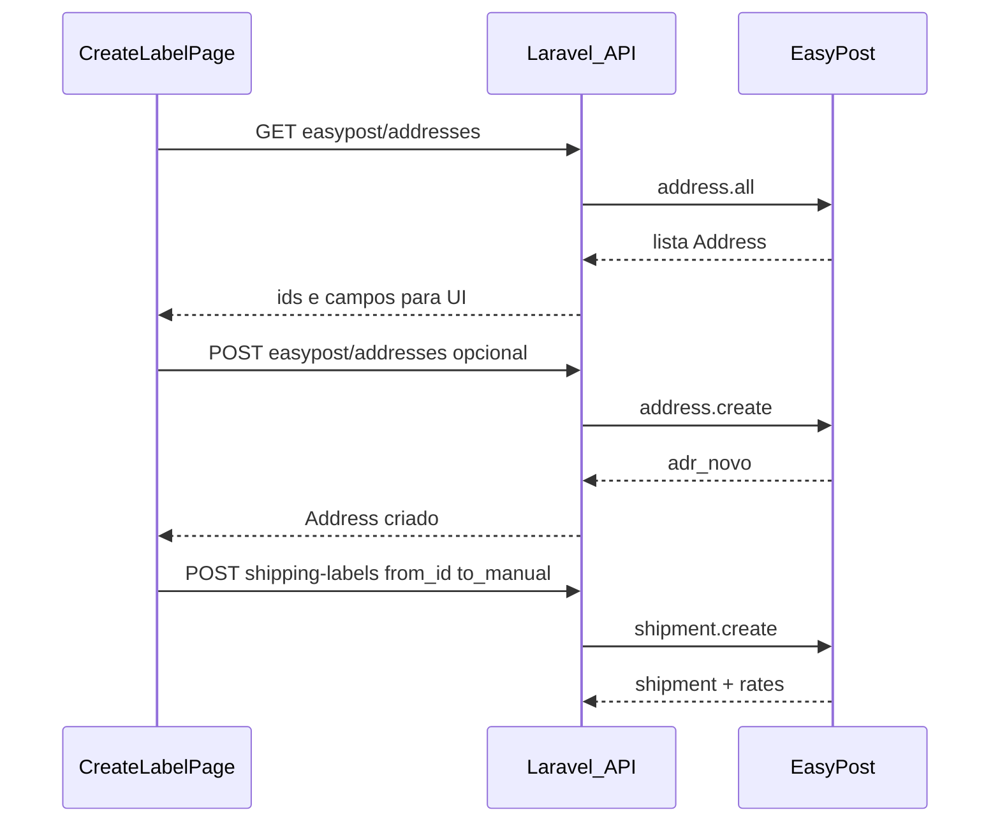

# Plano: endereços EasyPost salvos no fluxo de etiquetas

## Contexto (API EasyPost)

- [Listar endereços](https://docs.easypost.com/docs/addresses): `GET /v2/addresses?page_size=…` — devolve objetos `Address` com `id` (`adr_…`).
- [Criar endereço](https://docs.easypost.com/docs/addresses): `POST /v2/addresses` com corpo `address: { … }`; opcionais `verify`, `verify_strict`, `verify_carrier` (alinhado ao que já existe em `[config/services.php](config/services.php)` `easypost.verify_addresses`).
- Na criação de **Shipment**, `from_address` / `to_address` podem ser [objetos inline ou referência por `id](https://docs.easypost.com/docs/shipment)` — a opção escolhida foi **aceitar só `adr_…` no payload** da aplicação e montar o pedido à EasyPost com `{ id: "adr_…" }` (sem exigir todos os campos no JSON do cliente).

## 1) Backend: novos endpoints (proxy seguro)

Credencial: sempre a chave EasyPost do utilizador autenticado (mesmo padrão de `[EasyPostShippingIntegration::clientForUser](app/Integrations/Shipping/EasyPost/EasyPostShippingIntegration.php)`); a API key **nunca** vai para o browser.

| Método | Rota sugerida                                   | Comportamento                                                                                                                                                                                                                                                                                         |
| ------ | ----------------------------------------------- | ----------------------------------------------------------------------------------------------------------------------------------------------------------------------------------------------------------------------------------------------------------------------------------------------------- |
| GET    | `/api/integrations/shipping/easypost/addresses` | Query: `page_size` (ex.: máx. 100), opcional `before_id` / `after_id` se quiserem paginação completa. Chama `$client->address->all($params)` e devolve JSON normalizado (lista de `id`, `name`, `company`, `street1`, `street2`, `city`, `state`, `zip`, `country`, `phone`, `email`, `residential`). |
| POST   | `/api/integrations/shipping/easypost/addresses` | Body: campos de endereço alinhados ao POST EasyPost (mesmos nomes que o formulário já usa). Opcional: `verify` boolean (default = `config('services.easypost.verify_addresses')`). Chama `$client->address->create(...)`. Resposta: objeto Address criado.                                            |

- **Pré-condição:** integração EasyPost configurada; caso contrário **422** (igual a outras rotas de integração).
- **Ficheiros:** novo controller dedicado (ex. `[app/Http/Controllers/Api/EasyPostAddressController.php](app/Http/Controllers/Api/EasyPostAddressController.php)`) ou métodos em `[ShippingIntegrationController](app/Http/Controllers/Api/ShippingIntegrationController.php)`; preferência por controller pequeno só para addresses.
- **Serviço:** extrair `clientForUser` para um trait ou classe `[EasyPostClientFactory](app/Services/EasyPostClientFactory.php)` reutilizada pela integração de labels e por este controller, para não duplicar a leitura de `[UserShippingIntegration](app/Models/UserShippingIntegration.php)`.

## 2) Backend: `POST /shipping-labels` aceitar `id` ou endereço completo

Atualizar `[StoreShippingLabelRequest](app/Http/Requests/StoreShippingLabelRequest.php)`:

- Para `from_address` e `to_address`, validação em **dois modos** (mutuamente exclusivos por bloco):
  - **Modo referência:** `id` obrigatório, string, regex `^adr_[A-Za-z0-9]+$` (ou prefixo `adr_` + comprimento razoável). Nenhum outro campo obrigatório nesse bloco.
  - **Modo completo:** regras atuais (nome, empresa, ruas, cidade, estado, zip, país, telefone, email) como hoje.

Usar `required_without_all` / `prohibits` ou `Rule::when` para evitar mistura inválida (ex.: `id` + `street1` ao mesmo tempo — definir política: **se `id` está presente, ignorar outros** no `prepareForValidation` ou rejeitar com 422).

Atualizar `[EasyPostShippingIntegration::prepareAddresses](app/Integrations/Shipping/EasyPost/EasyPostShippingIntegration.php)` (e fluxo `verify`):

- Se o payload tiver **apenas `id`**: passar `['id' => $id]` para `shipment->create` **sem** `address->create` com `verify` (o endereço já existe na conta EasyPost; re-verificar é opcional — pode documentar como melhoria futura `retrieve` + inspeção de `verifications`).
- Se for **objeto completo**: manter lógica atual (incl. `verify_addresses`).

Garantir que `[ShippingLabelPayload](app/Data/ShippingLabelPayload.php)` e o repositório guardam o que for persistido em `from_address` / `to_address` (objeto completo ou `{ id }`) — já são `array`; ao mostrar na UI de revisão, se só houver `id`, opcionalmente enriquecer no `GET` show com um `retrieve` (fase 2) ou mostrar só o id; para o MVP, o frontend pode manter cópia dos campos após seleção **ou** fazer GET do address após seleção para preencher resumo.

## 3) Frontend: passos 1 e 2 (`[CreateLabelPage.jsx](resources/js/pages/CreateLabelPage.jsx)`)

- Ao entrar no step **Ship from** e **Ship to** (e se `integrationKey === 'easypost'` e integração ligada): `GET /api/integrations/shipping/easypost/addresses?page_size=50`.
- **UI:** secção acima do formulário: select ou lista pesquisável (“Usar endereço guardado”) + linha “ou preencher manualmente”.
  - Ao selecionar um endereço: definir estado `fromAddress` / `toAddress` como `{ id: 'adr_…' }` apenas (alinhado à opção **id_only**), e opcionalmente mostrar cartão só-leitura com dados (se a API de listagem já devolver os campos, dá para mostrar sem segundo pedido).
- **Cadastrar novo:** botão “Guardar este endereço na EasyPost” que faz `POST /api/integrations/shipping/easypost/addresses` com os campos atuais do formulário; em sucesso, atualizar lista local e opcionalmente selecionar o novo `id`.
- **Continuar / validação:** ajustar `validateAddressBlock` para aceitar modo só `id` (considerar válido se `a.id` começa com `adr`_) **ou** validação completa manual.
- **Payload do quote:** `POST /shipping-labels` envia `from_address` / `to_address` como `{ id }` quando aplicável.

## 4) Testes

- Feature: GET addresses com integração mockada ou cliente fake (se necessário, wrapper injetável em testes).
- Feature: `POST /shipping-labels` com `from_address: { id: adr_fake }` + `to_address` completo (e vice-versa) usando `FakeShippingIntegration` — pode exigir estender o fake para aceitar `id` em `quote()` ou usar integração EasyPost mockada.
- Unit: regras de `StoreShippingLabelRequest` para os dois modos.

## 5) Documentação

- Atualizar `[README.md](README.md)` (secção EasyPost): listar endpoints de address e comportamento id vs completo (frase curta).

## Riscos / decisões

- **Volume de endereços:** paginação; o cliente pode pedir “carregar mais” com `getNextPage` no backend num segundo endpoint ou query `after_id`.
- **Endereços de outros modos (test vs production):** a lista respeita a chave API do utilizador (já separa test/production).
- **Imutabilidade:** na EasyPost, Address não se edita; “alterar” é criar novo objeto. 

