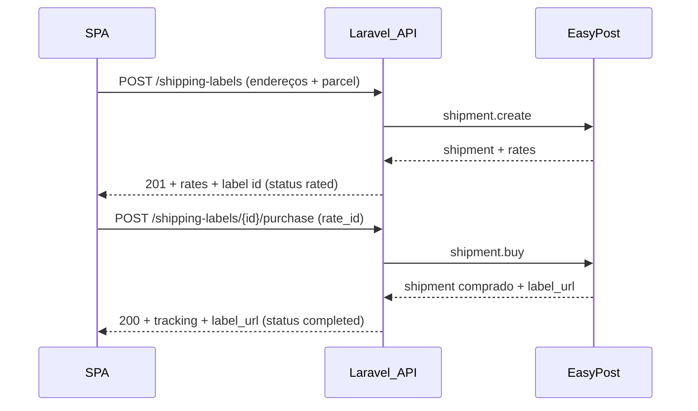

# Plano: cotação + compra de etiqueta EasyPost (sem fila na criação)

## Contexto e decisões

- **“Async” aqui** será tratado como **fluxo assíncrono no frontend** (duas chamadas `fetch`/axios), com **processamento síncrono no Laravel** (cada endpoint espera a EasyPost responder). Isso permite exibir `rates` na mesma sessão. **Não** enfileirar `ProcessShippingLabelJob` no `POST` inicial.
- **Limite do plano** ([`PlanLimitService`](app/Services/PlanLimitService.php)): hoje [`countForUserInCurrentMonth`](app/Repositories/Eloquent/ShippingLabelRepository.php) conta só etiquetas **completed**. O plano deve **manter a cobrança do limite no momento em que a etiqueta é efetivamente comprada** (passo 2), para não contar “cotações” abandonadas — mas isso **permite abusar da API** EasyPost. **Recomendação:** manter `assertWithinLimit` também no **passo 1** (igual ao comportamento atual de `enqueueForUser`), a menos que você queira mudar a regra de negócio.
- **Resposta EasyPost:** persistir o payload bruto (ou um snapshot estável) numa coluna JSON, ex.: `easypost_shipment_snapshot`, para auditoria e para validar o `rate_id` na compra.

## 1) Banco de dados e status

- Nova migration em [`database/migrations`](database/migrations): adicionar a `shipping_labels` uma coluna **`json` nullable** (nome sugerido: `easypost_shipment_snapshot`) guardando o corpo retornado por `POST /shipments` (objeto shipment serializado).
- Novo status em [`ShippingLabelStatus`](app/Models/ShippingLabelStatus.php) + [`ShippingLabelStatusSeeder`](database/seeders/ShippingLabelStatusSeeder.php), por exemplo slug **`rated`** (“Aguardando seleção de tarifa”), entre pending e completed.
- Fluxo de estados sugerido: `pending` (registro criado) → após sucesso do quote → **`rated`** (snapshot + `external_shipment_id` preenchido) → `processing` na compra → `completed` / `failed`.

## 2) Contrato da integração (PHP)

Refatorar [`ShippingLabelIntegrationInterface`](app/Integrations/Shipping/Contracts/ShippingLabelIntegrationInterface.php) para substituir o método único `label()` por algo equivalente a:

- **`quote(ShippingLabelPayload $payload): ShippingLabelQuoteResult`** — chama apenas `$client->shipment->create([...])` (sem `buy`). Retorna: `externalShipmentId`, lista normalizada de `rates` (para a API pública), e o **array/objeto bruto** para persistir.
- **`purchase(int $userId, string $externalShipmentId, string $rateId): ShippingLabelResult`** — chama `$client->shipment->buy($externalShipmentId, $rate)` onde `$rate` é identificado pelo `rate_id` (objeto `Rate` com esse id ou array `['id' => $rateId]` conforme o cliente já suporta).

Implementação em [`EasyPostShippingIntegration`](app/Integrations/Shipping/EasyPost/EasyPostShippingIntegration.php):

- Extrair `clientForUser` + `prepareAddresses` para uso em `quote`.
- **Remover** o `lowestRate(['USPS'])` fixo; o usuário escolhe a tarifa.
- Novo DTO, ex.: `ShippingLabelQuoteResult` (ou nome similar) em [`app/Data`](app/Data).

Atualizar [`FakeShippingIntegration`](tests/Support/FakeShippingIntegration.php) para implementar quote + purchase com dados determinísticos para testes.

## 3) Serviço, repositório e remoção da fila

- [`ShippingLabelService`](app/Services/ShippingLabelService.php):
  - Substituir `enqueueForUser` + dispatch de [`ProcessShippingLabelJob`](app/Jobs/ProcessShippingLabelJob.php) por um fluxo **`createQuotedLabel`**: valida integração EasyPost, (opcional) `assertWithinLimit`, cria registro, chama `quote`, persiste snapshot + `external_shipment_id`, associa status **`rated`**.
  - Novo método **`purchaseLabel(User, int $labelId, string $rateId)`**: carrega o label, verifica dono e status `rated`, valida que `rate_id` existe no JSON persistido (segurança), `assertWithinLimit` se ainda não tiver sido aplicado no passo 1, marca `processing`, chama `purchase`, `markCompleted`.
- [`ShippingLabelRepository`](app/Repositories/Eloquent/ShippingLabelRepository.php) / interface: métodos para persistir snapshot e transições de status; ajustar `createPending` ou criar factory específica para o novo fluxo.
- **`ProcessShippingLabelJob`:** deixar de ser usado neste fluxo; opções: remover a classe e referências, ou mantê-la apenas se outro código depender — após grep, remover dispatch e ajustar testes.

## 4) API HTTP

- [`routes/api.php`](routes/api.php): adicionar rota autenticada, ex.: `POST /shipping-labels/{shippingLabel}/purchase` (ou `.../buy`).
- [`ShippingLabelController`](app/Http/Controllers/Api/ShippingLabelController.php):
  - `store`: retornar **201** com o label + **`rates`** (derivados do snapshot) + talvez `messages` + `external_shipment_id`; não mais 202 “aceito na fila”.
  - Novo método `purchase` com Form Request validando `rate_id`.
- [`StoreShippingLabelRequest`](app/Http/Requests/StoreShippingLabelRequest.php): tornar **obrigatórios** (mínimo) para `from_address` e `to_address`:
  - `name`, `company`, `street1`, `street2` (permitir string vazia com `present` ou `required` + `max` — definir regra clara: ex. `required|string|max:255` aceita `""` para “sem complemento” se desejado), `city`, `state`, `zip`, `country`, `phone`, **`email`** (`required|email`).
- Novo request `PurchaseShippingLabelRequest` com `rate_id` obrigatório string.

Serialização em `serializeLabel` / respostas: incluir campos necessários ao SPA (`rates`, `easypost_messages`, `external_shipment_id`, snapshot ou subset — evitar resposta gigante se necessário truncar na API pública mas manter snapshot completo no banco).

## 5) Frontend ([`CreateLabelPage.jsx`](resources/js/pages/CreateLabelPage.jsx))

- Adicionar campo **email** nos dois blocos de endereço; marcar inputs como **required** alinhados ao backend.
- Ajustar `emptyAddr` e validações locais para exigir nome, empresa, telefone, e-mail, etc.
- Fluxo em etapas:
  1. Dados do pacote + endereços → `POST /api/shipping-labels` → recebe `id` + lista de `rates`.
  2. Nova UI: tabela ou lista de opções (carrier, service, preço, prazo) com radio/select.
  3. Botão “Comprar” → `POST /api/shipping-labels/{id}/purchase` com `{ rate_id }` → redirecionar para lista/detalhe conforme já existe.

Atualizar [`resources/js/api/http.js`](resources/js/api/http.js) se precisar de helpers (provavelmente não).

## 6) Testes

- Atualizar [`tests/Feature/ShippingLabelApiTest.php`](tests/Feature/ShippingLabelApiTest.php): fluxo em duas chamadas com `FakeShippingIntegration`; assert de status `rated` após store e `completed` após purchase; payloads com todos os campos obrigatórios.
- Ajustar [`tests/Unit/IntegrationResolverTest.php`](tests/Unit/IntegrationResolverTest.php) se a interface mudar.

## Riscos / notas

- **Tamanho do JSON:** o snapshot completo pode ser grande; `json` no PostgreSQL suporta bem; para API pública, considerar retornar só `rates` + `messages` + ids.
- **Etiquetas antigas** na base: labels `pending`/`processing` do modelo antigo podem precisar de tratamento ou migração pontual (se ainda não há produção, pode ignorar).

