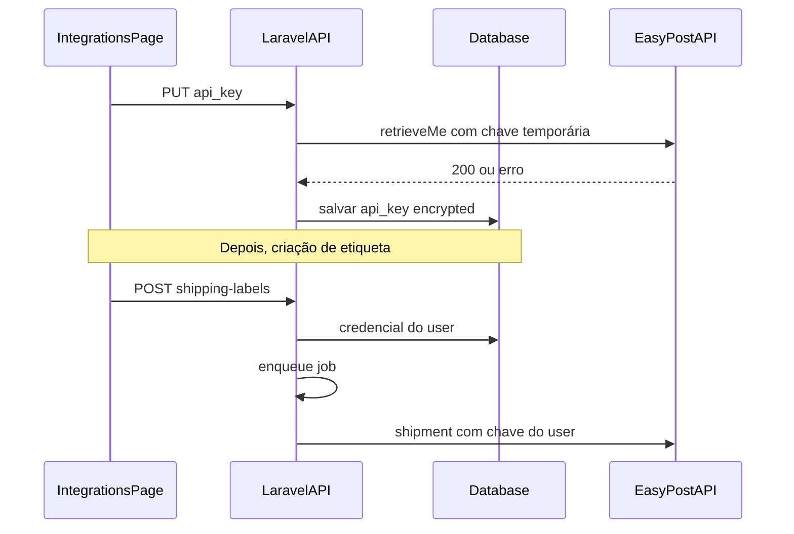

# Integrações EasyPost por usuário (planos mantidos)

## Decisões alinhadas com você

- **Planos da plataforma:** permanecem `plans`, `plan_id`, `PlanLimitService`, seeders e limites mensais.
- **Cadastro:** o usuário **não escolhe** plano; o backend atribui um plano padrão (ex.: slug `free` via [`RegistrationService`](app/Services/RegistrationService.php) / [`PlanRepository`](app/Repositories/Eloquent/PlanRepository.php)), removendo `plan_slug` do corpo da requisição e da UI em [`RegisterPage.jsx`](resources/js/pages/RegisterPage.jsx) e de [`RegisterUserRequest`](app/Http/Requests/RegisterUserRequest.php).
- **EasyPost:** deixa de depender só de [`config('services.easypost.key')`](config/services.php) para compra de etiquetas; cada usuário com credencial salva usa **a própria chave**. A variável de ambiente pode ficar **opcional** (ex.: apenas desenvolvimento ou futuro uso administrativo), documentado no README.

## Modelo de dados

- Nova tabela, por exemplo `user_shipping_integrations`, com: `user_id` (FK), `provider` (string, ex. `easypost`), `credentials` (JSON) **ou** coluna única `api_key` com **cast `encrypted`** no Eloquent (recomendado: uma coluna `api_key` criptografada pelo Laravel usando `APP_KEY`).
- Restrição **única** `(user_id, provider)` para um registro por provedor por usuário.
- Relação `User::hasOne` / `hasMany` conforme preferência (um registro por `easypost` é suficiente).

## Validação da chave antes de gravar

- Instanciar `EasyPost\EasyPostClient` com a chave informada (em memória, sem persistir em log).
- Chamar algo equivalente a **`$client->user->retrieveMe()`** (já usado nos testes oficiais do client em `vendor/easypost/easypost-php`).
- Em caso de falha (401/403 ou exceção da lib), responder **422** com mensagem clara; em sucesso, salvar/atualizar o registro criptografado.

## Backend — fluxo de etiquetas

- Incluir **`user_id`** no fluxo interno quando o job processa o rótulo: hoje [`ShippingLabelPayload`](app/Data/ShippingLabelPayload.php) é montado em [`ShippingLabelService::processQueuedLabel`](app/Services/ShippingLabelService.php) a partir do `ShippingLabel`; acrescentar `userId` (ou carregar `user` no label) para a integração saber de qual credencial ler.
- Refatorar [`EasyPostShippingIntegration`](app/Integrations/Shipping/EasyPost/EasyPostShippingIntegration.php) para **não** depender do singleton [`EasyPostClient`](app/Providers/AppServiceProvider.php) injetado com chave global: resolver credencial do usuário + `new EasyPostClient($plainKey)` dentro de `label()` (ou extrair um helper pequeno). Remover/afrouxar o binding singleton de `EasyPostClient` se ficar obsoleto.
- Em [`ShippingLabelService::enqueueForUser`](app/Services/ShippingLabelService.php) (e/ou no [`StoreShippingLabelRequest`](app/Http/Requests/StoreShippingLabelRequest.php) / controller): se `integration_key === 'easypost'`, **garantir** que existe credencial configurada; caso contrário, **422** orientando a configurar em Integrações.
- **Testes:** em `testing`, manter [`FakeShippingIntegration`](tests/Support/FakeShippingIntegration.php) no resolver; testes de feature podem criar credencial fake ou mockar o serviço de validação para não chamar EasyPost real.

## API REST (autenticada)

Estender ou complementar o que hoje é só listagem em [`ShippingIntegrationController`](app/Http/Controllers/Api/ShippingIntegrationController.php), por exemplo:

- `GET /integrations/shipping` — manter metadados dos provedores; opcionalmente incluir `configured: true/false` por provedor **sem** expor a chave.
- `PUT /integrations/shipping/easypost` (ou `POST .../connect`) — body: `api_key`; validar com `retrieveMe`; upsert criptografado.
- `DELETE /integrations/shipping/easypost` — remover credencial (opcional, mas útil).

Registrar rotas em [`routes/api.php`](routes/api.php) com `auth:api`.

## Frontend

- Nova página **Integrations** (ex.: [`resources/js/pages/IntegrationsPage.jsx`](resources/js/pages/IntegrationsPage.jsx)): formulário para EasyPost, estados de erro/sucesso, texto explicando que a chave fica só no servidor criptografada.
- Link no menu em [`AppShell.jsx`](resources/js/components/AppShell.jsx) (ícone + “Integrations”).
- Rota em [`App.jsx`](resources/js/App.jsx) (ex. `/integrations`).
- Ajustar fluxo de geração de etiquetas: se o usuário não tiver EasyPost configurado, a UI pode mostrar aviso ou link para `/integrations` (ex. em [`SelectIntegrationPage.jsx`](resources/js/pages/SelectIntegrationPage.jsx) ou na listagem).

## Diagrama do fluxo de credencial + etiqueta

## Arquivos principais a tocar

- Migração nova + model + (opcional) repositório pequeno.
- [`AppServiceProvider`](app/Providers/AppServiceProvider.php), [`EasyPostShippingIntegration`](app/Integrations/Shipping/EasyPost/EasyPostShippingIntegration.php), [`ShippingLabelService`](app/Services/ShippingLabelService.php), [`ShippingLabelPayload`](app/Data/ShippingLabelPayload.php).
- Novo `FormRequest` / controller de credenciais; testes em [`tests/Feature`](tests/Feature) e ajustes em [`ShippingLabelApiTest`](tests/Feature/ShippingLabelApiTest.php) / [`AuthApiTest`](tests/Feature/AuthApiTest.php) para registro sem `plan_slug`.
