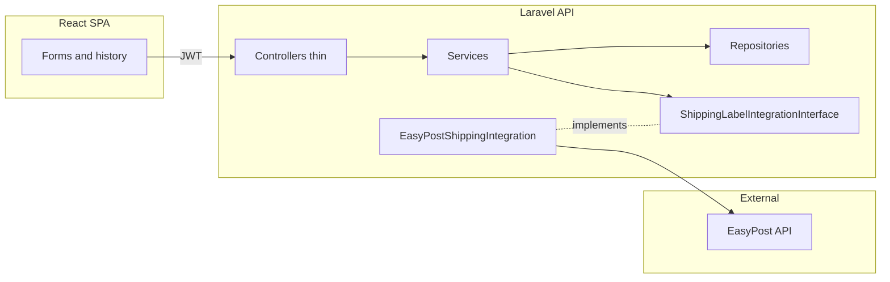

# Laravel 13 + React + Docker + EasyPost (plan)

## Scope and assumptions

- **Frontend:** **React.js (web)** + React Router + Tailwind (Vite), as required by [project-init.md](project-init.md)—**not** Inertia unless you later choose it; the browser talks to Laravel **only** via JSON under `/api` with **JWT** `Authorization: Bearer` (matches your “backend owns integrations” rule and avoids session-cookie coupling). Use `@vitejs/plugin-react` and a small auth/session store (e.g. React context or Zustand) for the JWT.
- **Database:** PostgreSQL in Docker (your choice overrides MySQL in [project-init.md](project-init.md) for local dev; document that in README).
- **IDs:** All primary/foreign keys as **auto-incrementing big integers** (no UUID columns).
- **Language:** UI strings, code identifiers, migrations, API messages, README, and the new Cursor rule: **English only**.
- **Comments:** Avoid nonessential comments in application code (per your preference).
- **Tests:** PHPUnit **unit** tests for domain logic with mocked dependencies; PHPUnit **feature** tests for HTTP/API flows; optional **Vitest** + React Testing Library for React units. Assertions and test descriptions in **English**.

## 1) Repository layout and existing files

- Preserve [project-init.md](project-init.md) at repo root (reference spec).
- Extend [.gitignore](.gitignore) to ignore: `vendor/`, `node_modules/`, `.env`, `.env.*`, Laravel caches, Vite build output, and `**.docker/postgres/data/`** (Postgres volume).
- Add `[.cursor/rules/](.cursor/rules/)` file (e.g. `english-only.mdc`) stating: English for UI copy, code, DB seed text, docs, commit messages; Portuguese only in chat with you if needed.

## 2) Laravel bootstrap without host PHP

- Use a **one-off Composer container** (e.g. `composer:2` on top of official PHP) to run `composer create-project laravel/laravel` into a **temporary directory**, then **move** the generated app into the repo root (merge `.gitignore`, keep `project-init.md` and preserve the directory .cursor/).
- Target **Laravel 13.x** per [Laravel 13 installation](https://laravel.com/docs/13.x/installation).
- Configure `.env` for `DB_CONNECTION=pgsql` pointing at the `postgres` Docker service.

## 3) Docker stack (local)

Create a root `docker-compose.yml` plus:

| Path                                     | Purpose                                                                                                                                                          |
| ---------------------------------------- | ---------------------------------------------------------------------------------------------------------------------------------------------------------------- |
| `[.docker/postgres/](.docker/postgres/)` | `Dockerfile` or image pin, optional `init.sql`, env defaults; bind volume `**.docker/postgres/data`**                                                            |
| `[.docker/php/](.docker/php/)`           | `Dockerfile` (extensions: `pdo_pgsql`, `mbstring`, `openssl`, `tokenizer`, `xml`, `ctype`, `json`, `bcmath`, `curl`), `php.ini`, optional `www.conf` for php-fpm |
| `[.docker/nginx/](.docker/nginx/)`       | `nginx.conf`, site config: `root` → `public`, `try_files` to `index.php`, pass PHP to `php-fpm:9000`                                                             |

Services (minimal): `postgres`, `app` (php-fpm), `nginx` (depends on `app`). Expose HTTP (e.g. `8080:80`). `APP_URL` aligned with that port.

## 4) Root Makefile

Targets (examples): `make up`, `make down`, `make build`, `make migrate`, `make fresh`, `make shell` (into `app`), `make npm-install`, `make npm-dev`, `make test` (runs `php artisan test` or `vendor/bin/phpunit` inside `app`), `make test-unit` / `make test-frontend` if you split suites, `make pint`—all thin wrappers over `docker compose`.

## 5) Backend packages and configuration

- **EasyPost:** `composer require easypost/easypost-php` ([official PHP client](https://github.com/EasyPost/easypost-php), listed under [Client Libraries](https://docs.easypost.com/libraries)). Store `EASYPOST_API_KEY` only in `.env` / Docker secrets; never expose to frontend.
- **JWT:** Add a maintained JWT package compatible with Laravel 13 (evaluate `php-open-source-saver/jwt-auth` or equivalent; pin version after `composer require`). Expose `POST /api/auth/register`, `POST /api/auth/login`, `POST /api/auth/logout` (optional blacklist if package supports), `GET /api/auth/me`.
- **CORS:** Restrict to your Vite dev origin and production URL.

## 6) Architecture patterns

**Repository pattern**

- Interfaces under `app/Repositories/Contracts/` (e.g. `UserRepositoryInterface`, `ShippingLabelRepositoryInterface`, `PlanRepositoryInterface`).
- Eloquent implementations under `app/Repositories/Eloquent/`.
- Bind interfaces in a provider (e.g. `RepositoryServiceProvider`).

**Service pattern**

- `app/Services/` for use cases: `AuthService`, `RegistrationService` (plan selection mock), `ShippingLabelService`, `PlanLimitService` (enforces limits from plan), `IntegrationResolver` (picks implementation by slug).

**Shipping integration contract (extensible)**

- `app/Integrations/Shipping/Contracts/ShippingLabelIntegrationInterface.php` with a small surface, e.g. `public function key(): string`, `public function label(ShippingLabelPayload $dto): ShippingLabelResult` (value objects / DTOs in `app/Data` or dedicated namespace—no comments-heavy files).
- `app/Integrations/Shipping/EasyPost/EasyPostShippingIntegration.php` implements the contract using `EasyPost\EasyPostClient` only inside this class (and possibly a thin `EasyPostClientFactory`).
- Register implementations in a service provider map `['easypost' => EasyPostShippingIntegration::class]` so adding a future USPS provider = new class + one provider binding.

## 7) Data model (increment IDs, consolidated relations)

Suggested tables (names illustrative, all `id` bigserial/bigint):

- `plans`: `name`, `slug`, `monthly_label_limit` (nullable = unlimited).
- `users`: credentials + `plan_id` (FK) for the mocked SaaS selection at signup.
- `shipping_labels`: `user_id` FK, `integration_key` (string, e.g. `easypost`), snapshot columns for addresses/parcel (JSON columns), `carrier`, `service`, `tracking_code`, `label_url` or storage path, `external_shipment_id`, timestamps.
- Optional `label_events` later—omit for prototype unless needed.

**Plan limits (mock):** seed `free` (10), `pro` (100), `unlimited` (null). `PlanLimitService` checks `COUNT(*)` of labels for current month (simple and good enough for prototype) before calling integration.

## 8) API surface (English errors/messages)

- Auth + plan assignment on register (body includes `plan_slug` mocked).
- `GET /api/integrations/shipping` — list available integrations (metadata only).
- `POST /api/shipping-labels` — validate **US-only** addresses + parcel; resolve integration; call service; persist row; return label metadata + URL for download/view.
- `GET /api/shipping-labels` — paginated history **scoped by authenticated user**.

Controllers stay thin: validate `FormRequest`, delegate to services.

## 9) Frontend (React + Tailwind)

- Install React, ReactDOM, React Router; add `**@vitejs/plugin-react`** to `vite.config.js` (per Vite + React defaults, aligned with Laravel’s Vite pipeline).
- Tailwind v4 using `**@tailwindcss/vite**` and `@import "tailwindcss"` in `resources/css/app.css` following [Install Tailwind with Laravel + Vite](https://tailwindcss.com/docs/installation/framework-guides/laravel/vite), with `@source` globs covering `resources/js/**/*` (or your chosen `resources/` paths) so class detection includes React components.
- Single mount point (minimal Blade shell) loading the Vite React entry (e.g. `resources/js/main.jsx`).
- **UX:** polished login/register, authenticated layout with **sidebar**: `Home`, `Shipping Labels` → landing card **Generate Shipping Label** → screen to **choose integration** (from API) → form (from/to US addresses, parcel) → success with print-friendly link.
- Central `api` client: base URL, attach JWT, handle 401 → redirect login.

## 10) Unit and automated tests

**Backend (PHPUnit, default Laravel stack)**

- **Unit tests** (`tests/Unit/`): focus on classes with deterministic behavior and **mocked** collaborators (no real DB or HTTP where avoidable). Priority targets: `PlanLimitService` (limits vs plan slug and monthly counts), `IntegrationResolver` (unknown key throws or fails predictably), any standalone validators or DTO normalization. Mock `ShippingLabelIntegrationInterface` with a hand-written fake or Mockery when testing `ShippingLabelService` orchestration without calling EasyPost.
- **Feature / API tests** (`tests/Feature/`): end-to-end HTTP against Laravel with `RefreshDatabase` (PostgreSQL in CI can mirror Docker; locally use same `.env.testing` or sqlite in-memory only if you explicitly accept divergence—prefer **pgsql** in Docker for parity). Cover: register/login/me, JWT guard on protected routes, `POST /api/shipping-labels` persists and returns expected shape when integration is bound to a **test double**, `GET /api/shipping-labels` returns only the authenticated user’s rows.
- **EasyPost:** never hit the real API in automated tests; bind a fake implementation or stub the client at the container level for feature tests.

**Frontend (Vitest + React Testing Library)**

- Add Vitest (Vite-native) and RTL; unit-test **non-trivial** pieces: API wrapper (JWT header, 401 handling), a small auth store/hook, and one critical flow component (e.g. integration picker or label form validation messages). Keep scope proportional to the take-home time box.

**Project hygiene**

- `php artisan test` and `npm run test` (or `vitest run`) documented in README; Makefile delegates to the `app` container so the host does not need PHP/Node for CI-like runs if everything runs in Docker.

## 11) Storage and printing

- Store label PDF/image URL from EasyPost response; if EasyPost returns a URL, persist it. Optionally `Storage::` mirror for resilience (decide one approach in implementation; prototype can store remote URL if acceptable).

## 12) Deliverables from original spec

- English **README** with Docker quick start, `make` commands, env vars (`EASYPOST_API_KEY`, JWT secrets, DB), how to run **unit and feature tests**, assumptions, and “what I’d do next”.

## 13) Implementation order (for the execution phase)

1. Docker + Makefile + empty Postgres volume ignore.
2. Composer container → Laravel skeleton into root + `.env` + `docker` wiring until `nginx` serves Laravel welcome page.
3. JWT package + auth routes + user/plan migrations + seeders.
4. Integration interface + EasyPost implementation + `ShippingLabelService` + repositories.
5. API endpoints + policies/scoping (user sees only own labels).
6. React app shell + auth flows + sidebar + shipping wizard.
7. **Tests:** add PHPUnit **unit** tests for plan limits and resolver/service behavior with mocks; **feature** tests for auth and shipping-label API using a fake integration; add Vitest + RTL for selected React modules; wire `make test` / documented npm script.
8. Tailwind polish and README updates (including test commands).

## Risks / notes

- **JWT package vs Laravel version:** Confirm compatibility matrix before locking `composer.json`.
- **EasyPost test mode:** Use test keys; document that buying real labels costs money ([EasyPost docs](https://docs.easypost.com)).
- **Take-home vs your stack:** README should state **PostgreSQL** (instead of MySQL) for local Docker; **React.js** matches [project-init.md](project-init.md).

